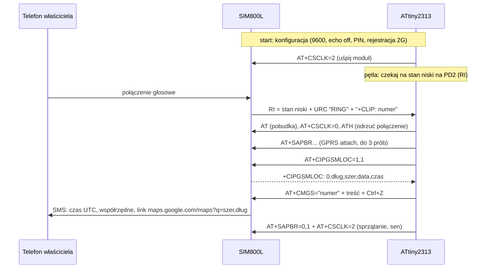

# Plan projektu: GPS tracker na ATtiny2313 + SIM800L

## Czy to możliwe?

**Tak.** Projekt referencyjny [mcore1976/gpstracker](https://github.com/mcore1976/gpstracker)
robi dokładnie to na ATtiny2313 + SIM800L i był testowany w terenie. Nasz port
(`avr-app/gps-tracker.c`, bazujący na `main3b.c`) po kompilacji zajmuje **1786 B z 2048 B
flasha (87%)** i 96 B ze 128 B RAM — mieści się, ale bez wielkiego zapasu. To ważne
ograniczenie: każda dodatkowa funkcja musi być pisana bardzo oszczędnie
(PROGMEM, bez `printf`, bez bibliotek).

Twój dotychczasowy kod UART (9600 bps, U2X, zegar 1 MHz) jest w 100% zgodny z podejściem
z projektu referencyjnego — to była właściwa baza.

### Ważne zastrzeżenia (przeczytaj przed zakupami)

1. **SIM800L to tylko 2G (GSM/GPRS).** W Polsce sieci 2G nadal działają (to 3G zostało
   wyłączone), ale operatorzy zapowiadają stopniowe wygaszanie 2G w perspektywie kilku lat.
   Na dziś (2026) tracker zadziała u polskich operatorów; nie jest to jednak inwestycja
   na dekadę.
2. **To nie jest prawdziwy GPS.** SIM800L nie ma odbiornika GPS — pozycja to lokalizacja
   najbliższej stacji bazowej BTS (dokładność: od ~200 m w mieście do kilku km w terenie).
   Prawdziwy GPS wymagałby modułu SIM808 (patrz projekt
   [mcore1976/sim808gpstracker](https://github.com/mcore1976/sim808gpstracker)).
3. **`AT+CIPGSMLOC` może nie działać na starym firmware SIM800L.** Ta komenda pierwotnie
   odpytywała API Google, które zostało wyłączone; nowsze firmware modułu korzysta
   z serwerów SIMCom. Jeśli na Twoim module `AT+CIPGSMLOC=1,1` zwraca błąd (kod inny niż 0),
   przetestuj alternatywę `AT+CLBS=1,1` (odpowiedź: `+CLBS: 0,<szer>,<dług>,<dokładność>` —
   uwaga, inna kolejność współrzędnych!). To sprawdzamy w kamieniu milowym M5, zanim
   zamrozimy kod.
4. **Zasilanie to najczęstsza przyczyna problemów z SIM800L.** Moduł pobiera impulsy
   do 2 A przy nadawaniu; bez grubego okablowania i kondensatora 1000 µF przy samym module
   będzie się resetował. Szczegóły w `docs/SCHEMAT.md`.

## Jak to działa (architektura docelowa)

```
   [Twój telefon] --- dzwonisz ---> [SIM800L] --RI/RING--> [ATtiny2313 PD2]
        ^                              ^  |
        |                         UART |  | (komendy AT, 9600 bps)
        '------- SMS z linkiem        |  v
                 do Google Maps    [ATtiny2313 PD0/PD1]
```

Przebieg pojedynczego cyklu (sekwencja):



Dodatkowo co 30 minut AVR budzi moduł i sprawdza zasięg (`AT+CREG?`). Przy braku zasięgu
włącza tryb samolotowy na 30 min (oszczędzanie baterii np. w podziemnym garażu).
Pobór prądu całości w czuwaniu: ~5 mA → ok. 2 tygodnie na 3×AA.

## Struktura repozytorium

| Plik | Rola |
|---|---|
| `avr-app/attiny-rpi-com.c` | ✅ test nadawania UART (istniejący) |
| `avr-app/attiny-rpi-2way-com.c` | ✅ echo UART, test dwukierunkowy (istniejący) |
| `avr-app/sim800l-test.c` | test komend AT: wysyła `AT`, miga diodą po odebraniu `OK` |
| `avr-app/gps-tracker.c` | docelowy firmware trackera |
| `uart-test/uart-*.py` | ✅ testy UART z poziomu RPi (istniejące) |
| `uart-test/sim800l-simulator.py` | symulator SIM800L na RPi — testy trackera bez modułu |
| `docs/PLAN.md` | ten plan |
| `docs/SCHEMAT.md` | projekt układu: połączenia, zasilanie, montaż |

## Kamienie milowe

### M0. Środowisko i UART — ✅ zrobione
Kompilacja przez `avr-build` (repo [kma-avr-env](https://github.com/krzycuh/kma-avr-env)),
wgrywanie avrdude/linuxgpio z RPi, echo UART działa (`attiny-rpi-2way-com.c` +
`uart-request-test.py`).

### M1. Rozmowa AT z symulatorem (bez nowego sprzętu)
1. Wgraj `avr-app/sim800l-test.c`.
2. Na RPi uruchom `python3 uart-test/sim800l-simulator.py`.
3. **Kryterium:** dioda PD3 miga 3× co ~2 s (AVR wysyła `AT`, dostaje `OK` i go rozpoznaje),
   a symulator wypisuje odbierane komendy.

### M2. Pełny firmware na symulatorze (bez nowego sprzętu)
1. Wgraj `avr-app/gps-tracker.c`. **Uwaga:** odłącz diodę LED z PD2 — w trackerze PD2 to
   wejście RI; zamiast diody podłącz PD2 do wolnego GPIO RPi (np. BCM 17) i uruchom
   symulator z `--ri-pin 17`.
2. Obserwuj sekwencję startową w konsoli symulatora (AT, ATE0, IPR, CPIN?, CREG?…).
3. Wpisz `ring` w konsoli symulatora.
4. **Kryterium:** symulator wypisuje „ODEBRANO SMS" z linkiem
   `http://maps.google.com/maps?q=52.237049,21.017532`. Przetestuj też scenariusz `noreg`
   (tracker powinien przejść w tryb samolotowy i ponawiać co 30 min — do testu można
   tymczasowo skrócić czasy w kodzie).

### M3. Zakup i poznanie SIM800L (nowy sprzęt: moduł SIM800L, karta SIM, antena)
1. Kup: moduł SIM800L (wersja na płytce z anteną), kartę SIM (nano→adapter; taryfa
   z SMS i GPRS; **wyłącz PIN karty w telefonie** albo ustaw 1111), przewody, kondensator
   1000 µF + 100 nF.
2. Podłącz SIM800L **bezpośrednio do RPi** (TXD/RXD/GND; zasilanie 4,0–4,2 V z osobnego
   źródła, NIE z pinu 5 V RPi przez cienkie przewody — patrz `docs/SCHEMAT.md`).
3. Rozmawiaj z modułem ręcznie (`minicom -D /dev/ttyS0 -b 9600` albo prosty skrypt):
   `AT+IPR=9600`, `AT&W` (utrwal prędkość!), `AT+CPIN?`, `AT+CREG?`, `AT+CSQ` (siła sygnału),
   ręczne wysłanie SMS: `AT+CMGF=1`, `AT+CMGS="+48..."`.
4. **Kryterium:** moduł zarejestrowany w sieci (`+CREG: 0,1`), SMS wysłany ręcznie dochodzi.

### M4. Lokalizacja przez GPRS (ten sam sprzęt co M3)
1. Nadal z RPi ręcznie: sekwencja `AT+SAPBR=3,1,...` (APN Twojego operatora!),
   `AT+SAPBR=1,1`, `AT+SAPBR=2,1`, potem `AT+CIPGSMLOC=1,1`.
2. Jeśli CIPGSMLOC zwraca błąd — testuj `AT+CLBS=1,1` (patrz zastrzeżenie nr 3).
3. **Kryterium:** dostajesz sensowne współrzędne swojej okolicy. Zanotuj działającą
   komendę i APN — wpisz je do `gps-tracker.c` (sekcja KONFIGURACJA).

### M5. Integracja AVR + SIM800L (płytka stykowa)
1. Połącz ATtiny2313 z SIM800L wg `docs/SCHEMAT.md` (UART na krzyż, RI→PD2, wspólna masa).
2. Wgraj `gps-tracker.c` (z poprawnym APN). Do podglądu można równolegle podpiąć RX RPi
   do linii TX AVR (podsłuch komend).
3. Zadzwoń na numer karty SIM trackera.
4. **Kryterium:** połączenie zostaje odrzucone po kilku sekundach, a po ~30–60 s
   przychodzi SMS z linkiem do mapy wskazującym Twoją okolicę.

### M6. Zasilanie docelowe i pobór prądu
1. Zbuduj sekcję zasilania (3×AA albo powerbank/akumulator — warianty w `docs/SCHEMAT.md`).
2. Zmierz pobór prądu w czuwaniu (cel: ~5 mA) i sprawdź, czy moduł nie resetuje się
   przy wysyłce SMS (spadki napięcia!).
3. **Kryterium:** tracker działa stabilnie na docelowym zasilaniu przez ≥24 h,
   odpowiada na kilka wywołań z rzędu.

### M7. Montaż docelowy i test terenowy
1. Przenieś układ na płytkę uniwersalną (grube ścieżki GND/VCC do SIM800L!),
   obudowa, antena z dala od elektroniki.
2. Test w aucie/rowerze: kilka zapytań z różnych miejsc, obserwacja czasu pracy na baterii.
3. **Kryterium:** poprawne SMS-y z różnych lokalizacji, czas pracy zgodny z oczekiwaniem
   (~2 tygodnie na 3×AA).

## Ograniczenia techniczne, o których warto pamiętać przy rozwoju

- **Flash 2 KB / RAM 128 B**: zostało ~260 B flasha zapasu. Rozbudowa (np. wysyłka na
  serwer HTTP, historia pozycji) wymaga przejścia na ATmega328P — kod referencyjny ma
  gotowe warianty (`main.c`/`mainb.c`).
- **Jeden UART**: ten sam port służy do testów z RPi i do rozmowy z SIM800L — stąd
  przełączanie „Programowanie/Runtime" na Twoim schemacie. Symulator (M1–M2) wykorzystuje
  to jako zaletę.
- **Brak weryfikacji odpowiedzi przy części komend** (świadoma decyzja z projektu
  referencyjnego — unikanie zakleszczeń kosztem ślepego `delay`). Przy debugowaniu
  patrz na to, co naprawdę odpowiada moduł (podsłuch przez RPi).
- **Watchdog nie jest używany** — jeśli tracker ma wisieć w aucie miesiącami, warto
  rozważyć dodanie watchdoga (koszt: ~100 B flasha).
