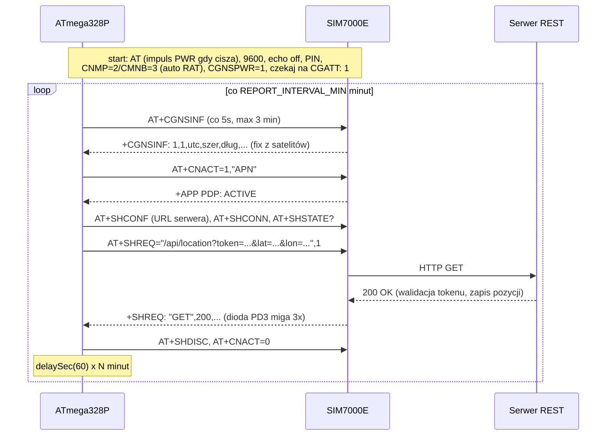

# Plan projektu: GPS tracker na ATmega328P + SIM7000E (raportowanie REST)

## Platforma

Po analizie ograniczeń SIM800L (pozycja tylko ze stacji BTS, brak TLS, wygaszane 2G)
projekt przeszedł na:

- **moduł: SIM7000E** na płytce [Waveshare NB-IoT/LTE/GPRS/GPS HAT](https://www.waveshare.com/wiki/SIM7000E_NB-IoT_HAT)
  — prawdziwy odbiornik GNSS (GPS/GLONASS/Galileo/BeiDou) + LTE Cat-M1 + NB-IoT
  + **fallback do 2G (EDGE/GPRS)**; w zestawie obie anteny i kabel USB; goldpiny UART
  z logiką 3,3 V, praca standalone bez RPi,
- **mikrokontroler: ATmega328P (DIP-28)** — 32 KB flasha zdejmuje ograniczenia ATtiny2313
  (2 KB, zapełnione w 86%); ten sam toolchain avr-gcc + avrdude/linuxgpio na RPi,
  ten sam styl kodu UART (rejestry z sufiksem `0`), fabryczne fuse bity (1 MHz).

Firmware `avr-app/gps-tracker.c` po kompilacji: **1984 B z 32768 B flasha (6%)** —
jest miejsce na rozwój (HTTPS, buforowanie pozycji, watchdog).

### Ważne zastrzeżenia

1. **LTE-M w Orange a zwykła karta SIM**: Orange PL kieruje LTE-M do ofert M2M
   („[Orange IoT na kartę](https://nasz.orange.pl/t5/Oferty-polecane-przez/Orange-IoT-na-kart%C4%99-nowa-taryfa-prepaid/td-p/267951)",
   oferty biznesowe), ale są doniesienia, że zwykłe karty też logują się do LTE-M.
   Sprawdzamy empirycznie w M4 (`AT+CNMP=38` + `AT+CMNB=1` + `AT+CEREG?`).
   **Fallback:** SIM7000E umie EDGE/GPRS, więc zwykła karta Orange zadziała
   w najgorszym razie po 2G — firmware ustawia tryb automatyczny (`AT+CNMP=2`).
2. **GNSS potrzebuje nieba.** Pierwszy (zimny) fix trwa do kilku minut i wymaga anteny
   z widocznością nieba (okno, deska rozdzielcza). W garażu podziemnym fixu nie będzie —
   firmware pomija wtedy cykl raportu. Rozszerzenie „wyślij ostatnią znaną pozycję"
   to łatwy dodatek na później.
3. **HTTP na start, HTTPS jako etap 2.** SIM7000E obsługuje TLS 1.2, ale konfiguracja
   (wgranie certyfikatu CA / wyłączenie weryfikacji, `AT+CSSLCFG` + `AT+SHSSL`) to
   dodatkowa warstwa do debugowania. Plan: uruchamiamy wszystko po HTTP z tokenem,
   a po stabilizacji (M5) dokładamy TLS — wtedy token przestaje iść jawnym tekstem.
   Do tego czasu: token = losowy ciąg, nie żadne Twoje hasło.
4. **Zasilanie:** HAT wymaga 5 V z wydajnością min. 2 A (szczyty transmisji; w LTE-M
   niższe niż 2-amperowe strzały 2G, ale zapas musi być). Na płytce HAT-a jest już
   przetwornica i kondensatory — odpada ręczne budowanie sekcji zasilania z SIM800L.
5. **Serwer musi być osiągalny z publicznego internetu** (tracker łączy się z sieci
   operatora): VPS, darmowy tier chmury albo domowy serwer z przekierowaniem portu.
   Do pierwszych testów wystarczy podgląd żądań na [webhook.site](https://webhook.site).

## Jak to działa (architektura docelowa)

```
[ATmega328P] --UART/AT--> [SIM7000E HAT] --LTE-M/NB-IoT/2G, HTTP GET--> [Serwer REST]
      ^                        |  ^                                          |
      |                     GNSS (satelity)                                  v
      '-- co N minut: CGNSINF -> lat,lon                            pozycje.csv / mapa
```

Przebieg pojedynczego cyklu raportowania:



Odporność na błędy: timeout ~5 s na każdy znak z UART, automatyczny impuls na pin PWR
HAT-a gdy moduł milczy (~20 s), pominięcie cyklu przy braku fixu GNSS, tryb samolotowy
na 30 min przy dłuższym braku sieci. Brak raportu = brak mignięcia diody i dziura
w logu serwera — łatwo diagnozować.

## Struktura repozytorium

| Plik | Rola |
|---|---|
| `avr-app/attiny-rpi-com.c` | ✅ test nadawania UART (ATtiny2313, historyczny) |
| `avr-app/attiny-rpi-2way-com.c` | ✅ echo UART (ATtiny2313, historyczny) |
| `avr-app/at-test.c` | ATmega328P: test AT→OK z diodami (krok pośredni) |
| `avr-app/gps-tracker.c` | ATmega328P: docelowy firmware trackera (SIM7000E, REST) |
| `uart-test/uart-*.py` | ✅ testy UART z poziomu RPi (istniejące) |
| `uart-test/sim7000-simulator.py` | symulator SIM7000E na RPi — testy trackera bez HAT-a |
| `server-test/location-server.py` | przykładowy serwer REST (walidacja tokenu, log CSV) |
| `docs/PLAN.md` | ten plan |
| `docs/SCHEMAT.md` | projekt układu: połączenia, zasilanie, montaż |

Uwaga do środowiska: `avr-build` z [kma-avr-env](https://github.com/krzycuh/kma-avr-env)
musi dostać możliwość wyboru MCU (`-mmcu=atmega328p` dla avr-gcc i `-p m328p` dla
avrdude) — dotychczas celował w ATtiny2313.

## Kamienie milowe

### M0. Środowisko i UART — ✅ zrobione (na ATtiny2313)
Kompilacja przez `avr-build`, wgrywanie avrdude/linuxgpio z RPi, echo UART działa.

### M1. Migracja na ATmega328P (nowy sprzęt: ATmega328P DIP)
1. Rozszerz `avr-build` o parametr MCU (atmega328p).
2. Podłącz ATmegę do RPi wg `docs/SCHEMAT.md` (ISP: RESET/MOSI/MISO/SCK + zasilanie
   3,3 V; **AVCC połączone z VCC!**).
3. Wgraj `avr-app/at-test.c`; na RPi uruchom `python3 uart-test/sim7000-simulator.py`.
4. **Kryterium:** dioda PD3 miga 3× co ~2 s (AVR wysyła `AT`, dostaje `OK`), symulator
   wypisuje odbierane komendy. To potwierdza: programowanie ATmegi + UART działają.

### M2. Pełny firmware na symulatorze (bez HAT-a)
1. Wgraj `avr-app/gps-tracker.c` (do szybszych testów możesz tymczasowo skrócić
   `REPORT_INTERVAL_MIN` do 1).
2. Obserwuj sekwencję startową (AT, ATE0, IPR, CPIN?, CNMP, CMNB, CGNSPWR, CGATT?),
   potem odpytywanie `AT+CGNSINF` (symulator daje fix po 3 zapytaniach) i raport.
3. **Kryterium:** symulator wypisuje blok „RAPORT HTTP GET" z tokenem i współrzędnymi
   `lat=52.237049 lon=21.017532`, dioda PD3 miga po `+SHREQ: "GET",200`.
   Przetestuj też: `nofix` (cykl pominięty), `httpfail` (bez mignięcia), `noreg`
   (tracker czeka/backoff).

### M3. Serwer REST (bez nowego sprzętu)
1. Uruchom `server-test/location-server.py` na maszynie osiągalnej z internetu.
2. Wygeneruj losowy token (`openssl rand -hex 16`), wpisz do serwera (`--token`)
   i do `gps-tracker.c` (`API_TOKEN`); ustaw `API_SERVER` i `API_PATH`.
3. **Kryterium:** `curl` z poprawnym tokenem → `200 OK` i wpis w `pozycje.csv`;
   zły token → `403`.

### M4. Uruchomienie HAT-a bez AVR (nowy sprzęt: SIM7000E HAT, karta SIM)
1. Włóż kartę SIM (PIN wyłączony), przykręć obie anteny; antena GPS przy oknie.
2. Podłącz HAT po USB (kabel w zestawie) do RPi/laptopa, `minicom` na porcie modemu.
3. Przećwicz ręcznie cały dialog firmware'u: `AT`, `AT+CPIN?`, `AT+CNMP=2`, `AT+CMNB=3`,
   `AT+CGATT?`, `AT+CGNSPWR=1`, `AT+CGNSINF` (czekaj na fix), `AT+CNACT=1,"internet"`,
   `AT+SHCONF="URL","http://twoj-serwer:8080"`, `AT+SHCONN`,
   `AT+SHREQ="/api/location?token=...&lat=...&lon=...",1`, `AT+SHDISC`, `AT+CNACT=0`.
4. Sprawdź LTE-M na swojej karcie Orange: `AT+CNMP=38` + `AT+CMNB=1`, potem `AT+CEREG?`
   i `AT+COPS?` — zaloguje się albo nie; wróć do `AT+CNMP=2` (auto).
5. **Kryterium:** wpis z prawdziwymi współrzędnymi w `pozycje.csv` na serwerze +
   wiedza, czy jedziesz po LTE-M czy po 2G. Zanotuj APN → wpisz do `gps-tracker.c`.

### M5. Integracja AVR + HAT (płytka stykowa)
1. Połącz ATmegę z goldpinami HAT-a wg `docs/SCHEMAT.md` (UART na krzyż, PD4→PWR,
   wspólna masa; HAT zasilany z 5 V, AVR z 3,3 V).
2. Wgraj `gps-tracker.c` z docelowym APN/URL-em/tokenem.
3. **Kryterium:** co `REPORT_INTERVAL_MIN` minut nowy wpis w `pozycje.csv`, dioda PD3
   miga po każdym raporcie. Test odporności: odłącz antenę GPS (cykle pominięte),
   zatrzymaj serwer (brak mignięć), włącz z powrotem — samo wraca.

### M6. Zasilanie docelowe i pobór prądu
1. Zasil całość z powerbanka 5 V/2 A (AVR przez mały stabilizator 3,3 V, np. AMS1117
   albo z pinu 3,3 V HAT-a jeśli wyprowadzony).
2. Zmierz pobór prądu; włącz oszczędzanie: `AT+CGNSPWR=0` między raportami (wolniejszy
   fix, mniejszy prąd), ewentualnie tryby PSM/eDRX LTE-M (`AT+CPSMS`) — SIM7000E ma
   je wbudowane. Dobierz `REPORT_INTERVAL_MIN`.
3. **Kryterium:** stabilna praca ≥24 h na baterii, regularne wpisy w logu bez dziur
   wskazujących na restarty.

### M7. HTTPS + montaż docelowy + test terenowy
1. Dołóż TLS: `AT+CSSLCFG="sslversion",1,3` + `AT+SHSSL` (start: bez weryfikacji
   certyfikatu; docelowo wgranie CA przez `AT+CFSWFILE`), serwer za reverse proxy
   z certyfikatem (np. Caddy/nginx + Let's Encrypt).
2. Przenieś układ na płytkę uniwersalną, obudowa, anteny z dala od elektroniki.
3. Test w aucie/rowerze: przejazd po mieście, weryfikacja trasy z `pozycje.csv`.
4. **Kryterium:** poprawna trasa na mapie, czas pracy zgodny z pomiarem z M6.

## Pomysły na dalszy rozwój (flash już nie ogranicza)

- wysyłka ostatniej znanej pozycji gdy brak fixu (flaga „stale" w parametrach),
- buforowanie pozycji przy braku sieci i dosyłanie paczką,
- POST z JSON-em zamiast GET (`AT+SHBOD` + `AT+SHREQ=...,3`),
- watchdog sprzętowy ATmegi,
- prosta strona WWW z mapą nad `pozycje.csv` (leaflet + OpenStreetMap).
