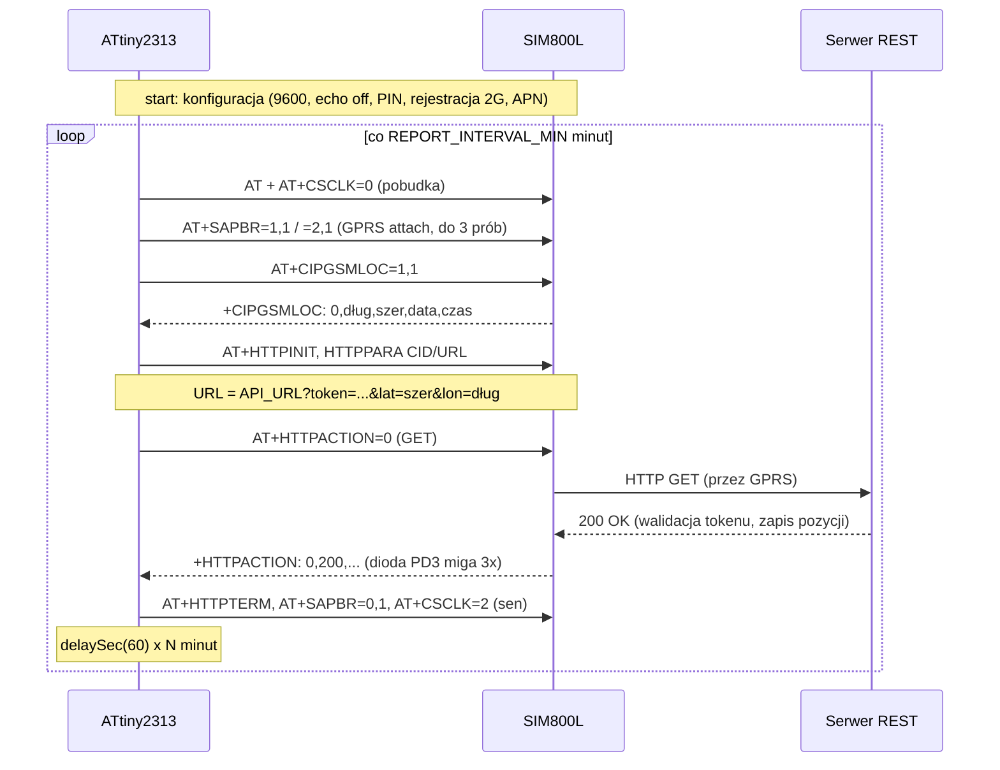

# Plan projektu: GPS tracker na ATtiny2313 + SIM800L (raportowanie REST)

## Czy to możliwe?

**Tak.** Projekt referencyjny [mcore1976/gpstracker](https://github.com/mcore1976/gpstracker)
dowodzi, że ATtiny2313 + SIM800L wystarcza na pełny tracker. Nasza wersja
(`avr-app/gps-tracker.c`) różni się od referencyjnej modelem komunikacji: **zamiast
dzwonienia i SMS tracker cyklicznie wysyła pozycję przez GPRS na serwer web (REST)**,
korzystając z wbudowanego klienta HTTP modułu SIM800L (`AT+HTTP*`).

Po kompilacji firmware zajmuje **1762 B z 2048 B flasha (86%)** i 82 B ze 128 B RAM —
mieści się, ale bez wielkiego zapasu. Uwaga: adres serwera i token są wkompilowane
w kod, więc **każdy znak URL-a i tokenu to 1 bajt flasha** — zostało ~280 B zapasu.

Twój dotychczasowy kod UART (9600 bps, U2X, zegar 1 MHz) jest w 100% zgodny z tym
podejściem — to była właściwa baza.

### Ważne zastrzeżenia (przeczytaj przed zakupami)

1. **SIM800L to tylko 2G (GSM/GPRS).** W Polsce sieci 2G nadal działają (to 3G zostało
   wyłączone), ale operatorzy zapowiadają stopniowe wygaszanie 2G w perspektywie kilku lat.
   Na dziś (2026) tracker zadziała u polskich operatorów; nie jest to jednak inwestycja
   na dekadę.
2. **To nie jest prawdziwy GPS.** SIM800L nie ma odbiornika GPS — pozycja to lokalizacja
   najbliższej stacji bazowej BTS (dokładność: od ~200 m w mieście do kilku km w terenie).
   Prawdziwy GPS wymagałby modułu SIM808 (patrz projekt
   [mcore1976/sim808gpstracker](https://github.com/mcore1976/sim808gpstracker)).
3. **`AT+CIPGSMLOC` może nie działać na starym firmware SIM800L.** Ta komenda pierwotnie
   odpytywała API Google, które zostało wyłączone; nowsze firmware modułu korzysta
   z serwerów SIMCom. Jeśli na Twoim module `AT+CIPGSMLOC=1,1` zwraca błąd (kod inny niż 0),
   przetestuj alternatywę `AT+CLBS=1,1` (odpowiedź: `+CLBS: 0,<szer>,<dług>,<dokładność>` —
   uwaga, inna kolejność współrzędnych!). To sprawdzamy w kamieniu milowym M4, zanim
   zamrozimy kod.
4. **Tylko czysty HTTP, bez HTTPS.** Wbudowany TLS SIM800L to przestarzały SSL3/TLS1.0 —
   współczesne serwery go odrzucą. Konsekwencje:
   - endpoint musi przyjmować `http://` (osobny port/vhost, poza resztą Twoich usług),
   - token idzie jawnym tekstem — traktuj go jako słabe uwierzytelnienie (odsiewa
     skanery), używaj losowego ciągu **niebędącego żadnym Twoim hasłem**,
   - serwer waliduje token i najlepiej niech nic nie zwraca poza „OK".
5. **Serwer musi być osiągalny z publicznego internetu** (tracker łączy się z sieci
   operatora): VPS za parę złotych, darmowy tier chmury, albo domowy serwer
   z przekierowaniem portu. Do pierwszych testów wystarczy podgląd żądań na
   [webhook.site](https://webhook.site) (działa po HTTP).
6. **Zasilanie to najczęstsza przyczyna problemów z SIM800L.** Moduł pobiera impulsy
   do 2 A przy nadawaniu; bez grubego okablowania i kondensatora 1000 µF przy samym module
   będzie się resetował. Szczegóły w `docs/SCHEMAT.md`.

## Jak to działa (architektura docelowa)

```
[ATtiny2313] --UART/AT--> [SIM800L] --GPRS/HTTP GET--> [Twój serwer REST]
     ^                                                       |
     '-- co N minut: CIPGSMLOC -> lat,lon                    '--> pozycje.csv / mapa
```

Przebieg pojedynczego cyklu raportowania:



Odporność na błędy: timeout ~5 s na każdy znak z UART (firmware nie zawiesi się, gdy
modem zamilknie), 3 próby GPRS attach, pełna rekonfiguracja gdy attach pada (np. po
restarcie modułu od spadku napięcia), a przy braku zasięgu 2G — tryb samolotowy na
30 min i ponowne szukanie sieci.

Pobór prądu w czuwaniu: ~5 mA; każdy raport to kilkanaście–kilkadziesiąt sekund
aktywności GPRS. Przy raporcie co 10 min czas pracy na 3×AA będzie zauważalnie krótszy
niż w wersji „na żądanie" (rzadsze raporty = dłuższa praca — do zmierzenia w M6).

## Struktura repozytorium

| Plik | Rola |
|---|---|
| `avr-app/attiny-rpi-com.c` | ✅ test nadawania UART (istniejący) |
| `avr-app/attiny-rpi-2way-com.c` | ✅ echo UART, test dwukierunkowy (istniejący) |
| `avr-app/sim800l-test.c` | test komend AT: wysyła `AT`, miga diodą po odebraniu `OK` |
| `avr-app/gps-tracker.c` | docelowy firmware trackera (REST) |
| `uart-test/uart-*.py` | ✅ testy UART z poziomu RPi (istniejące) |
| `uart-test/sim800l-simulator.py` | symulator SIM800L na RPi — testy trackera bez modułu |
| `server-test/location-server.py` | przykładowy serwer REST (walidacja tokenu, log CSV) |
| `docs/PLAN.md` | ten plan |
| `docs/SCHEMAT.md` | projekt układu: połączenia, zasilanie, montaż |

## Kamienie milowe

### M0. Środowisko i UART — ✅ zrobione
Kompilacja przez `avr-build` (repo [kma-avr-env](https://github.com/krzycuh/kma-avr-env)),
wgrywanie avrdude/linuxgpio z RPi, echo UART działa (`attiny-rpi-2way-com.c` +
`uart-request-test.py`).

### M1. Rozmowa AT z symulatorem (bez nowego sprzętu)
1. Wgraj `avr-app/sim800l-test.c`.
2. Na RPi uruchom `python3 uart-test/sim800l-simulator.py`.
3. **Kryterium:** dioda PD3 miga 3× co ~2 s (AVR wysyła `AT`, dostaje `OK` i go rozpoznaje),
   a symulator wypisuje odbierane komendy.

### M2. Pełny firmware na symulatorze (bez nowego sprzętu)
1. Wgraj `avr-app/gps-tracker.c` (na razie z domyślnym URL/tokenem; do szybszych testów
   możesz tymczasowo skrócić `REPORT_INTERVAL_MIN` do 1).
2. Uruchom symulator i obserwuj sekwencję startową (AT, ATE0, IPR, CPIN?, CREG?, SAPBR…).
3. **Kryterium:** symulator wypisuje blok „RAPORT HTTP GET" z tokenem i współrzędnymi
   `lat=52.237049 lon=21.017532`, a dioda PD3 miga 3× po `+HTTPACTION: 0,200`.
   Przetestuj też `httpfail` (dioda nie miga, tracker idzie spać i ponawia w kolejnym
   cyklu) oraz `noreg` przy starcie (tryb samolotowy).

### M3. Serwer REST (bez nowego sprzętu)
1. Uruchom `server-test/location-server.py` na maszynie osiągalnej z internetu
   (VPS / domowy serwer z przekierowaniem portu). Test: `curl` z linkiem wypisywanym
   przy starcie serwera.
2. Wygeneruj losowy token (np. `openssl rand -hex 16`) i wpisz go do serwera
   (`--token`) oraz do `gps-tracker.c` (`API_TOKEN`); ustaw `API_URL`.
3. **Kryterium:** `curl` z poprawnym tokenem → `200 OK` i wpis w `pozycje.csv`;
   zły token → `403`.

### M4. Zakup i poznanie SIM800L (nowy sprzęt: moduł SIM800L, karta SIM, antena)
1. Kup: moduł SIM800L (wersja na płytce z anteną), kartę SIM (taryfa z **pakietem
   danych**; SMS-y niepotrzebne; **wyłącz PIN karty** albo ustaw 1111), przewody,
   kondensator 1000 µF + 100 nF.
2. Podłącz SIM800L **bezpośrednio do RPi** (TXD/RXD/GND; zasilanie 4,0–4,2 V z osobnego
   źródła, NIE z pinu 5 V RPi przez cienkie przewody — patrz `docs/SCHEMAT.md`).
3. Rozmawiaj z modułem ręcznie (`minicom -D /dev/ttyS0 -b 9600`):
   `AT+IPR=9600`, `AT&W` (utrwal prędkość!), `AT+CPIN?`, `AT+CREG?`, `AT+CSQ` (siła sygnału).
4. Ręcznie przejdź całą sekwencję GPRS + lokalizacja + HTTP (to dokładnie to, co robi
   firmware):
   `AT+SAPBR=3,1,"APN","<apn-operatora>"` → `AT+SAPBR=1,1` → `AT+SAPBR=2,1` →
   `AT+CIPGSMLOC=1,1` → `AT+HTTPINIT` → `AT+HTTPPARA="CID",1` →
   `AT+HTTPPARA="URL","http://twoj-serwer:8080/api/location?token=...&lat=...&lon=..."` →
   `AT+HTTPACTION=0` → czekaj na `+HTTPACTION: 0,200,...` → `AT+HTTPTERM`.
5. Jeśli CIPGSMLOC zwraca kod błędu — testuj `AT+CLBS=1,1` (patrz zastrzeżenie nr 3)
   i dostosuj firmware.
6. **Kryterium:** wpis z prawdziwymi współrzędnymi Twojej okolicy pojawia się
   w `pozycje.csv` na serwerze. Zanotuj działający APN → wpisz do `gps-tracker.c`.

### M5. Integracja AVR + SIM800L (płytka stykowa)
1. Połącz ATtiny2313 z SIM800L wg `docs/SCHEMAT.md` (UART na krzyż, wspólna masa —
   linia RI nie jest już potrzebna).
2. Wgraj `gps-tracker.c` z docelowym APN/URL/tokenem. Do podglądu możesz podpiąć
   RX RPi do linii TX AVR (podsłuch komend).
3. **Kryterium:** co `REPORT_INTERVAL_MIN` minut w `pozycje.csv` pojawia się nowy wpis,
   dioda PD3 miga po każdym udanym raporcie.

### M6. Zasilanie docelowe i pobór prądu
1. Zbuduj sekcję zasilania (3×AA albo powerbank/akumulator — warianty w `docs/SCHEMAT.md`).
2. Zmierz pobór prądu w czuwaniu i podczas raportu; sprawdź, czy moduł nie resetuje się
   przy transmisji (spadki napięcia!). Dobierz `REPORT_INTERVAL_MIN` do oczekiwanego
   czasu pracy na baterii.
3. **Kryterium:** tracker działa stabilnie na docelowym zasilaniu ≥24 h, regularne wpisy
   w logu, bez dziur wskazujących na restarty.

### M7. Montaż docelowy i test terenowy
1. Przenieś układ na płytkę uniwersalną (grube ścieżki GND/VCC do SIM800L!),
   obudowa, antena z dala od elektroniki.
2. Test w aucie/rowerze: przejazd po mieście, weryfikacja trasy z `pozycje.csv` na mapie.
3. **Kryterium:** ciągłość raportów z trasy, czas pracy na baterii zgodny z pomiarem z M6.

## Ograniczenia techniczne, o których warto pamiętać przy rozwoju

- **Flash 2 KB / RAM 128 B**: zostało ~280 B zapasu, a URL+token wchodzą w ten budżet.
  Rozbudowa (POST z JSON-em, buforowanie pozycji, HTTPS przez własne proxy) wymaga
  przejścia na ATmega328P — kod referencyjny mcore1976 ma gotowe warianty.
- **GET zamiast POST**: świadomy wybór — parametry w URL nie wymagają `AT+HTTPDATA`
  (oszczędność ~150 B flasha). REST-owo poprawniejszy POST z JSON-em łatwo dodać
  po stronie ATmega328P; serwer przykładowy łatwo rozszerzyć.
- **Jeden UART**: ten sam port służy do testów z RPi i do rozmowy z SIM800L — stąd
  przełączanie „Programowanie/Runtime" na Twoim schemacie. Symulator (M1–M2) wykorzystuje
  to jako zaletę.
- **Watchdog nie jest używany** — timeouty UART załatwiają większość zawieszeń, ale
  jeśli tracker ma wisieć w aucie miesiącami, warto dodać watchdog (~100 B flasha).
